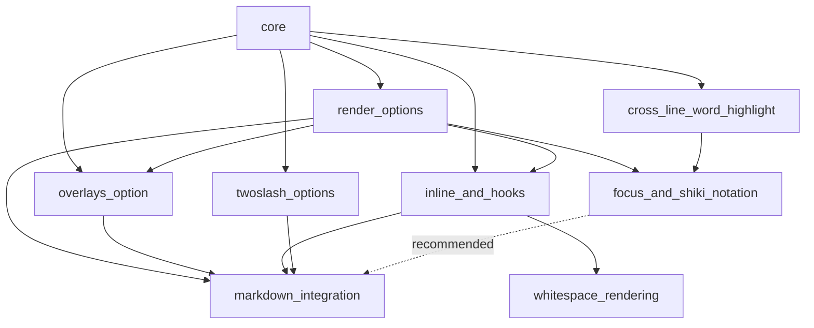

# Twinkleplop — parity specs

Eight tasks that let a shiki 4.4.3 user do the same things to one highlighted
snippet in twinkleplop, plus a shared contract they all rely on. Each spec is
an independently shippable change with its own acceptance criteria. They
came out of a side-by-side comparison of twinkleplop `main` (`4fa1284`) and
shiki 4.4.3 run on identical inputs; the published Parity Plan page holds
the input/output evidence for each one.

## Specs

- [core](./core.md) — shared contract: public surface, output shape, overlay semantics, marker grammar, class vocabulary, and the constraints every task must keep (absent option means identical output, no tree, snake_case, escaping). Not a task.
- [render_options](./render_options.md) — `line_numbers: { start }`, `attributes` on `<pre>`, automatic `has-*` classes. Small.
- [overlays_option](./overlays_option.md) — `overlays` render option and `overlays()` builder: ranges by offset or line/character, whole lines, hidden ranges. Small.
- [inline_and_hooks](./inline_and_hooks.md) — `structure: "inline"` and the `line` / `token` hooks. Medium.
- [whitespace_rendering](./whitespace_rendering.md) — `whitespace` and `indent_guides` render options. Small.
- [focus_and_shiki_notation](./focus_and_shiki_notation.md) — ship `focus`, honour `parse: "raw"`, and a `shiki_notation` plugin that reads `[!code …]` unchanged. Medium.
- [cross_line_word_highlight](./cross_line_word_highlight.md) — the set form takes a line scope: `=x +N`, `=x :N...M`, `=x :*`. Small.
- [twoslash_options](./twoslash_options.md) — custom tags by default, `on_error` fallback, `render_docs`, `process_type`, split doc tags, in both twoslash packages. Medium.
- [markdown_integration](./markdown_integration.md) — `@twinkleplop/rehype`, `@twinkleplop/markdown-it`, `@twinkleplop/remark` over one core: registry, fence meta conventions, inline code, twoslash trigger, diagnostics. Large.

## Suggested order

1. render_options
2. overlays_option
3. inline_and_hooks
4. whitespace_rendering
5. cross_line_word_highlight
6. focus_and_shiki_notation
7. twoslash_options
8. markdown_integration

Items 1–4 are renderer-only and can proceed in parallel with 5–7, which
live in the annotation extractor and the twoslash packages. Item 8 is last
because it consumes all of them.

## Dependencies

## Open cross-cutting questions

- **Fence meta conventions.** [markdown_integration](./markdown_integration.md) lists both the shiki/VitePress family and rehype-pretty-code's and does not decide between them. To discuss before implementation.
- **`has-*` naming for multi-class classifications.** A classification may hold several classes (the shiki-compat mapping emits `diff add`); `has-` prefixes only the first token. Confirmed in [render_options](./render_options.md) and documented in the annotation README with that implementation.
- **Performance budget for opt-in features.** Every spec requires the no-option path to stay within the perf harness noise floor. What overhead is acceptable when an option *is* used is the feature's cost, not waste, but nobody has put a number on it.

## Deliberately not specified

These stay open after all eight tasks, because closing them would change
what twinkleplop is or they are grammars rather than API: element-level
decorations (tag names and attributes per range), a document tree or
running shiki transformer objects, resumable tokenizer state and streaming,
an ANSI grammar, fenced-code embedding inside the markdown grammar, per-part
twoslash markup overrides, and scope-aware bracket colouring for generics.
